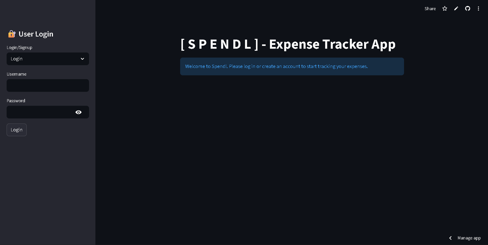
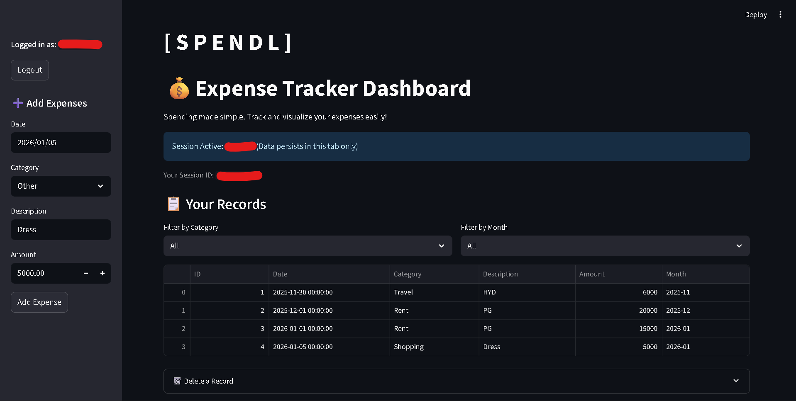
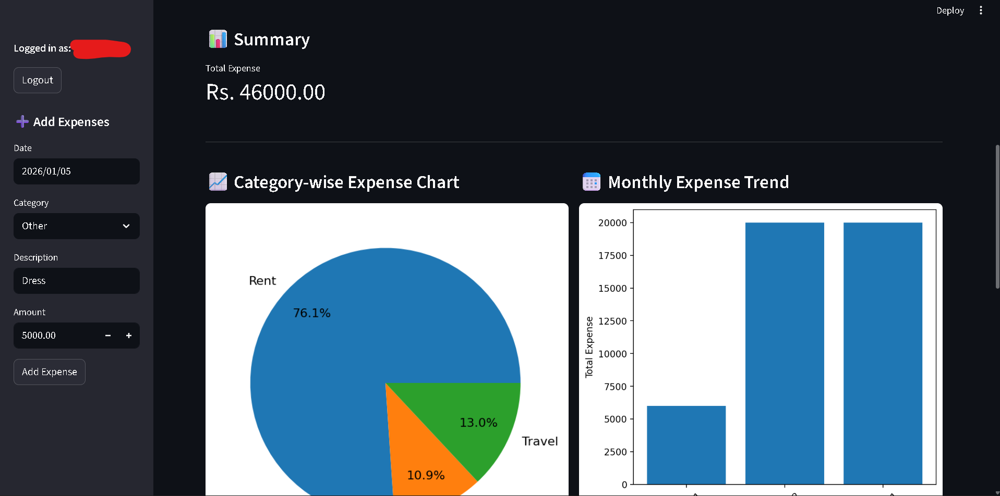
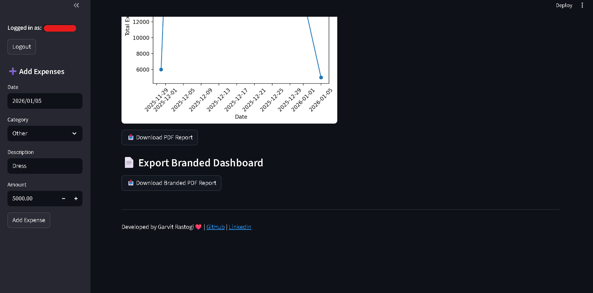

# 💰 Spendl - Personal Expense Tracker

[](https://spendl-expense-tracker-app.streamlit.app/)

Spendl is a professional-grade expense tracking application built with **Streamlit** and **SQLite**. It allows users to manage their finances with a secure login system, interactive data visualizations, and branded PDF report exports.

## 🚀 Features

- **Secure Authentication**: User sign-up and login system with hashed passwords for data privacy.
- **Expense Management**: Add, view, filter, and delete expense records.
- **Interactive Dashboard**: Visualize spending habits with Category Pie Charts, Monthly Trends, and Daily Activity graphs.
- **Professional PDF Reports**: Export your data into a beautifully formatted, branded PDF report.
- **Persistent Storage**: Data is stored in a local SQLite database, ensuring your records stay safe even after closing the app.

## 🛠️ Tech Stack

- **Frontend**: Streamlit
- **Database**: SQLite3
- **Data Analysis**: Pandas
- **Visualization**: Matplotlib
- **PDF Generation**: FPDF

## 📸 Screenshots

*Figure 1: Login / Sign Up Page*
---

*Figure 2:Dashboard, Adding Expenses Page*
---

*Figure 3: Summary and Visualization*
---

*Figure 4: Footer includes Exporting Pdf*
---

## 🛠️ Data Architecture
The application uses a relational SQLite database with two primary tables:
- **Users**: Stores encrypted credentials (Username, Hashed Password).
- **Expenses**: Stores transaction data linked to specific users via the `username` foreign key.


## 📦 Installation & Setup

1. **Clone the repository**:
   ```bash
   git clone [https://github.com/GarvitRastogi978/Spendl-Expense-Tracker-App.git](https://github.com/GarvitRastogi978/Spendl-Expense-Tracker-App.git)
   cd Spendl-Expense-Tracker-App

---

### How to add this to your GitHub:

1.  **Save the file** as `README.md` in your `expense_tracker` folder.
2.  **Run these commands** in your terminal to push it to your website:
    ```bash
    git add README.md
    git commit -m "Added professional README file"
    git push origin main
    ```

---
